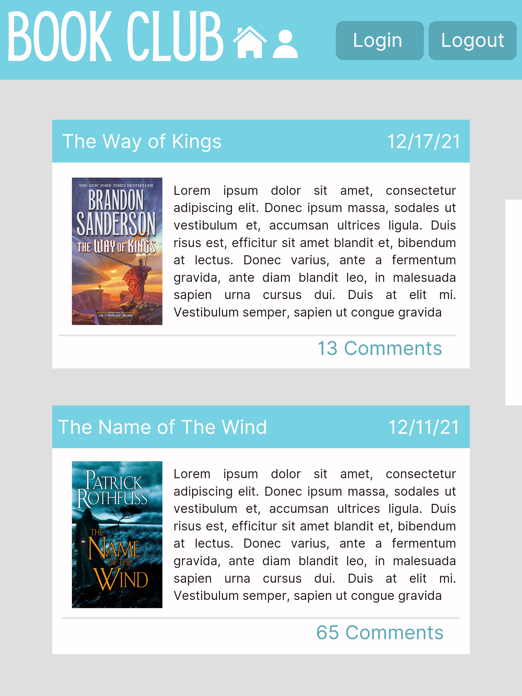
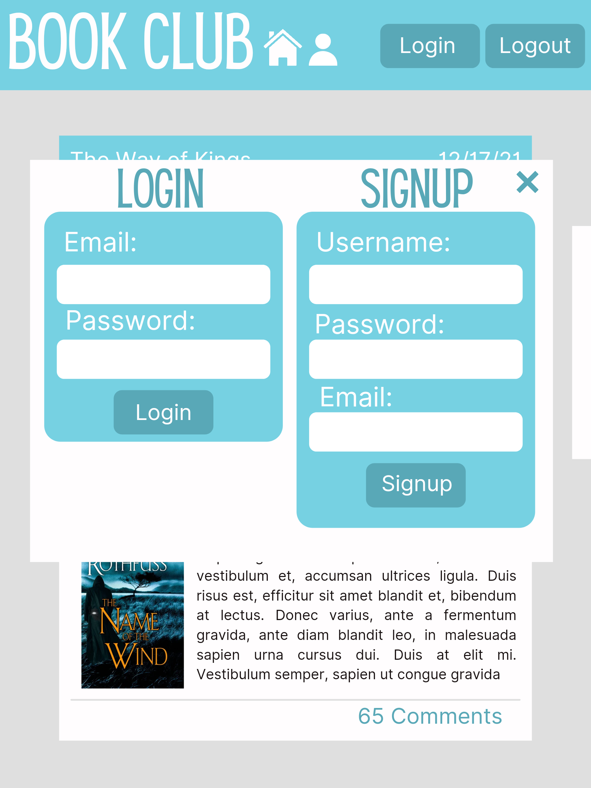
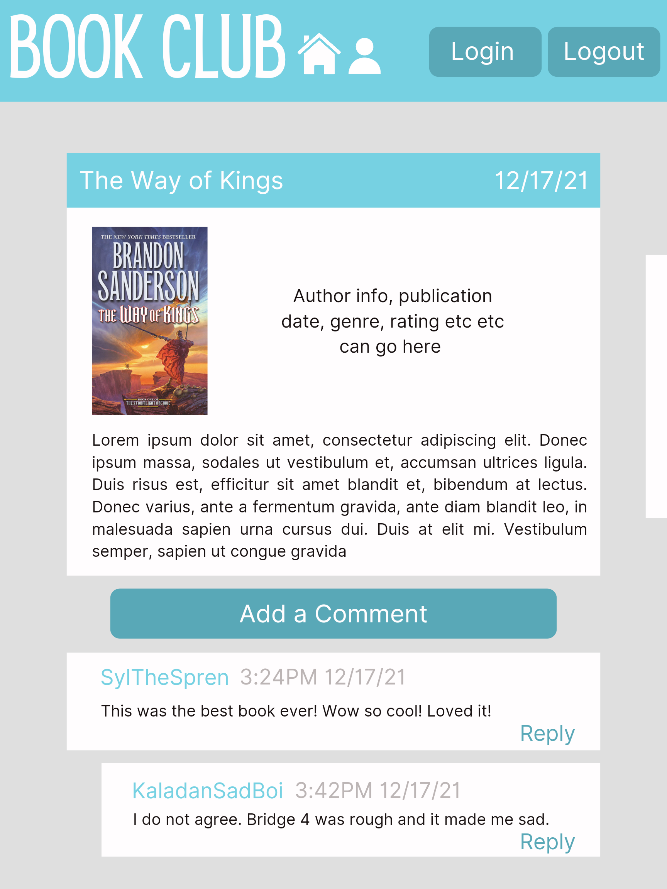
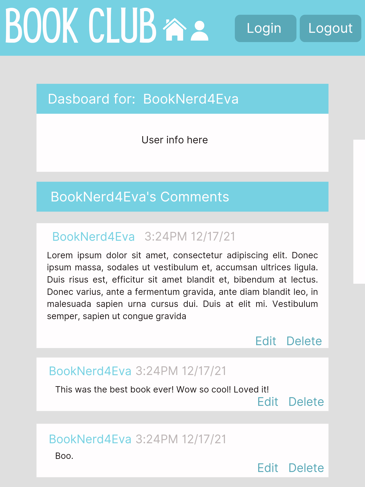

<h1 align="center">Interactive Full-Stack Project: Book Club</h1>
  

    
    
    

 <h4>🔍 Designed and coded by <a href="https://github.com/HaileyThomas">Hailey Thomas</a> | <a href="https://github.com/Hanstyl">Nathan Nelson</a> | <a href="https://github.com/alviszheng">Alvis Zheng</a> | <a href="https://github.com/JamesVelarde">James Velarde</a>

 

Are you interested to find out the trending books? Do you want to exchange comment with other book fans? This app will help you to find some close-knit group of people that you can share your thoughts about the book you all love. Book club allow you to search by book, read the review and add you comment to the book. Sign up today!

✋ [GitHub Repository](https://github.com/HaileyThomas/book-club/)

✋ [Deployed Application URL](https://book-club123.herokuapp.com/)

## Table of Contents

- [Data Model](#data-model)
- [Wireframe](#wireframe)
- [Installation](#installation)
- [Usage](#usage)
- [Purpose](#purpose)
- [Screenshots](#screenshots)
- [License](#license)
- [Contributing](#contributing)
- [Issues](#issues)
- [Development](#development)
- [Tests](#tests)
- [Links](#links)
- [Questions](#questions)

## 💿 Data Model

<h1 align="center">
        
</h1>

## 🖼️ Wireframe

- 
 
 
 

## 💾 Installation

  To install this code, download the zip file, or use GitHub's guidelines to clone the repository. Also, you need to install [Node.js](https://nodejs.org/en/) and a text editor. Once you have Node.js installed, then install Node Package Manager(npm) and a few dependencies such as Express, Handlebars and Sequelize. 

  `npm init`

  `npm install`

## 💻 Usage
  
  Run the following command at the root of your project:

  `mysql -u root -p`

  Enter Password when promted

  `source db/schema.sql`

  `quit`

  `npm run seed`
    
  `npm start`

## 📖 User Story

`AS AN avid reader in the midsts of a pandemic 

I WANT to be able to find new books to read and have a place to discuss them with others who have also read them.

SO THAT i can expose myself to new books and different perspectives.`

## 📷 Screenshots

- 
- 
- 

## ✏️ License

  
   
  Copyright <2021>

Permission to use, copy, modify, and/or distribute this software for any purpose with or without fee is hereby granted, provided that the above copyright notice and this permission notice appear in all copies.

THE SOFTWARE IS PROVIDED "AS IS" AND THE AUTHOR DISCLAIMS ALL WARRANTIES WITH REGARD TO THIS SOFTWARE INCLUDING ALL IMPLIED WARRANTIES OF MERCHANTABILITY AND FITNESS. IN NO EVENT SHALL THE AUTHOR BE LIABLE FOR ANY SPECIAL, DIRECT, INDIRECT, OR CONSEQUENTIAL DAMAGES OR ANY DAMAGES WHATSOEVER RESULTING FROM LOSS OF USE, DATA OR PROFITS, WHETHER IN AN ACTION OF CONTRACT, NEGLIGENCE OR OTHER TORTIOUS ACTION, ARISING OUT OF OR IN CONNECTION WITH THE USE OR PERFORMANCE OF THIS SOFTWARE.

## 👪 Contributing

- <a href="https://github.com/HaileyThomas">Hailey Thomas</a> 
- <a href="https://github.com/Hanstyl">Nathan Nelson</a>
- <a href="https://github.com/alviszheng">Alvis Zheng</a> 
- <a href="https://github.com/JamesVelarde">James Velarde</a> 

## 🔍 Issues

No issues at this time.

## ⚙️ Development

- In the future we would like to finish developing the "reply" feature to comments.

## ✏️ Testing

No testing at this time.

## 🔍 Links

- [This app is deployed on Heroku (click here to see app)](https://book-club123.herokuapp.com/)

## ❓ Questions

  If you have any queries feel free to contact us through our Github profile at  
  👋 [Hailey](https://github.com/HaileyThomas)  
  👋 [Nathan](https://github.com/Hanstyl) 
  👋 [Alvis](https://github.com/alviszheng) 
  👋 [James](https://github.com/JamesVelarde) 
